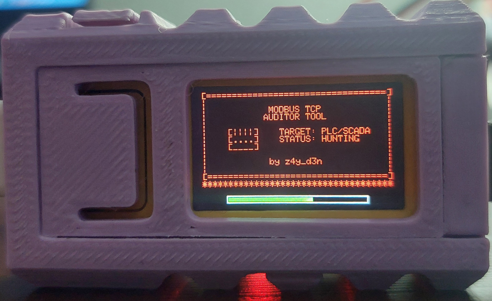
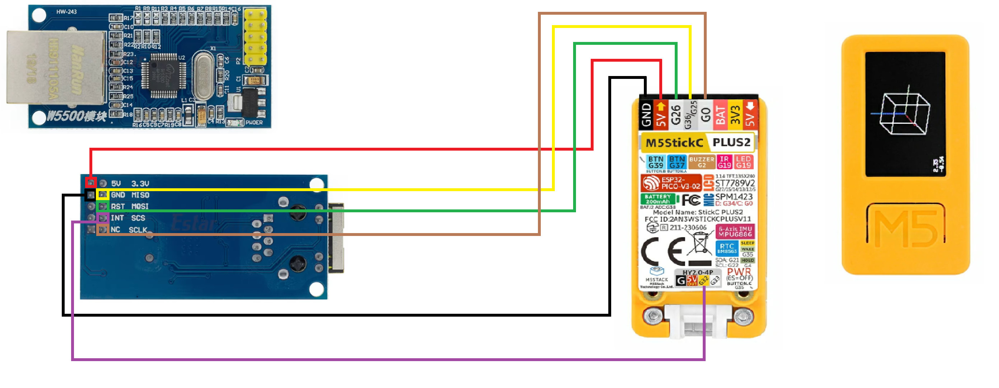

# Modbus TCP Auditor Tool

## Overview
The Modbus TCP Auditor Tool is a specialized, hardware-based assessment instrument designed for Operational Technology (OT) and Industrial Control Systems (ICS) environments. Running exclusively on the M5StickC Plus2 ecosystem with W5500 Ethernet support, it provides security researchers and engineers with a portable platform for protocol analysis, network discovery, and vulnerability assessment.

## Legal disclaimer and terms of use
This software and hardware configuration is provided strictly for authorized security auditing, academic research, and defensive engineering. The author assumes no liability for misuse, unauthorized access, equipment damage, or production downtime. Interacting with Programmable Logic Controllers (PLCs) and OT networks without explicit, documented authorization is illegal and poses severe safety and operational risks. 

## Intended use cases
* Validating the resilience and rule configurations of secure Industrial Gateways equipped with IDS/IPS capabilities.
* Conducting practical, safe demonstrations of industrial protocol vulnerabilities for university students in automation and control programs.
* Performing routine, authorized security assessments during scheduled OT maintenance windows.
* Simulating physical breach scenarios for Red Team engagements focusing on IT/OT convergence and network segregation testing.

## Core capabilities
* **Layer 2 / Layer 3 Discovery:**
    * **Stealth Reconnaissance (Layer 2):** Utilizes a MACRAW engine to silently sniff traffic and mathematically infer subnet sizes without broadcasting a single packet.
    * **Low-Noise Network Integration (Layer 3):** Once the network is mapped, it utilizes delayed GARP (Gratuitous ARP) collision checks for stealthy IP auto-assignment, avoiding noisy DHCP requests.
* **Protocol Fingerprinting & MAC Spoofing:** Extracts vendor, model, and firmware revision data from targets via Modbus Encapsulated Interface (MEI). Supports hardware-level MAC spoofing to impersonate legitimate engineering workstations (e.g., Siemens, Schneider Electric, Rockwell Automation).
* **Active Memory Auditing:** Provides direct read/write access to Modbus data structures, including Coils, Discrete Inputs, Holding Registers, and Input Registers.
* **Target Stress Testing (Fuzzer):** Injects anomalous and malformed Modbus TCP payloads to evaluate the robustness of the target PLC's internal TCP stack and application-layer parsers. *(Note: This active stress testing module is strictly for use against isolated testbenches or digital twins, as it may cause denial-of-service in legacy PLC TCP stacks)*

## Hardware requirements
* **Main Controller:** M5Stack M5StickC Plus2.
* **Network Interface:** M5Stack LAN Module (W5500 chipset). While the integrated Wi-Fi can be used for basic connectivity, the W5500 module is mandatory for Layer 2 MACRAW inference and hardware-level packet crafting.

## Hardware Wiring (W5500 SPI Pinout)

To utilize the Ethernet capabilities, including the passive L2 MACRAW engine, you must connect a W5500 module to the M5StickC Plus2 via the SPI interface.

**Bottom Connector (8-pin):**
* `SCLK` -> `G0`
* `MOSI` -> `G26`
* `MISO` -> `G36` *(Note: Physical pad shared G25/G36)*
* `5V` -> `5V`
* `GND` -> `GND`

**Top Connector (4-pin Grove Port):**
* `SCS / CS` -> `G32`

## Interface and navigation controls
The tool is designed for one-handed operation in the field, utilizing the device's physical buttons and internal IMU (Inertial Measurement Unit).

* **Button A (Front Button):**
    * **Short Press:** Navigate forward, increment values, or change the current selection.
    * **Long Press (A(L)):** Press and hold for more than 800 ms to change pages, skip in large increments (e.g., +/- 100), or jump to the next memory address range.
* **Button B (Side Button):**
    * **Short Press:** Confirm selection, execute an active scan/attack, or enter a specific menu.
    * **Long Press (B(L)):** Press and hold for more than 800 ms to stop an active process, return to the previous menu level, or safely sever a connection to a target.
* **IMU (Accelerometer) Gestures:** Tilting the device forward or backward modifies the direction of navigation (e.g., dynamically switching between incrementing or decrementing memory addresses).

## Installation and Deployment

### Plug-and-Play (Recommended)
For zero-friction deployment without managing compilation environments or library dependencies:
1.  Download the latest `modbus_tcp_auditor.bin` from the project's Releases section.
2.  Launch the official M5Burner software on your workstation.
3.  Connect the M5StickC Plus2 via USB.
4.  Select the appropriate COM port, load the `.bin` file, and execute the flash process.

### Compilation from source
For code auditing, creating forks, or implementing custom modifications:
1.  Configure the Arduino IDE for the M5StickC Plus2 board.
2.  Install the following libraries via the Library Manager:
    * `M5StickCPlus2` (Latest)
    * `Ethernet` by Various (v2.0.2)
3.  Compile and upload the source code to the device.

## License
This project is licensed under the GNU General Public License v3.0. See the `LICENSE` file for full details.

## Author
**z4y_d3n**
* GitHub: <https://github.com/z4y-d3n>